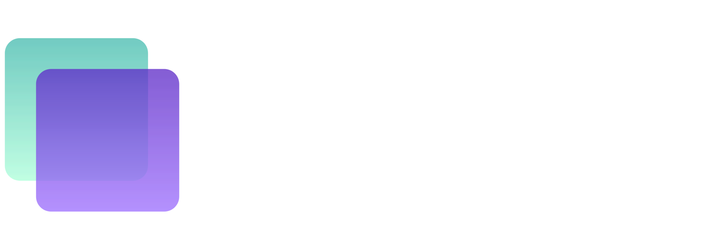

### Structured Synthetic Dataset Generator for Computer Vision

> **Built for Bria FIBO Hackathon 2025**  
> Deterministic, reproducible, ML-ready visual datasets using JSON-native prompts

[](https://lumenset.vercel.app/)
[](https://youtube.com/your-video-link)
---

## 🎯 The Problem

Computer vision and ML projects require **thousands of training images** with controlled variations:
- ❌ Same object from multiple angles
- ❌ Consistent lighting conditions  
- ❌ Structured metadata for reproducibility
- ❌ Background and environment control

**Traditional solutions are expensive:**
- 💰 Professional photography: $5,000-50,000+ per dataset
- ⏱️ Studio setup, lighting rigs, multiple shoots
- 📝 Manual annotation and metadata creation
- 🔄 Cannot reproduce exact conditions

---

## ✅ The Solution

**LumenSet** generates production-ready synthetic datasets with **unprecedented control** using Bria FIBO's JSON-native architecture:

✨ **Disentangled Parameters** - Change camera angle without affecting object identity, lighting, or materials  
🔒 **100% Reproducible** - Seed-locked generation ensures identical outputs  
📊 **Rich Metadata** - Every image includes complete JSON manifest with all generation parameters  
⚡ **Batch Generation** - Create 4-150+ variations in automated sweeps  
📦 **Export-Ready** - Download ZIP with organized folders, manifests, and reproduction instructions

---

## 🎥 Demo Video

**[▶️ Watch 3-Minute Demo on YouTube](https://youtube.com/your-video-link)**

---

## 🚀 Live Demo

**👉 [lumenset.vercel.app](https://lumenset.vercel.app/)**

*Try it yourself:*
1. Enter any object description (e.g., "ceramic coffee mug")
2. Configure camera angles and lighting
3. Generate a small dataset (4-8 images)
4. Download the ZIP and inspect metadata

---

## ✨ Key Features

### 🎛️ **Precision Parameter Control**
- **Camera:** Rotation (-90° to 90°), Tilt (-45° to 45°), Zoom (macro/mid/telephoto)
- **Lighting:** Direction (front/side/back/top), Quality (diffused/hard), Color temperature
- **Environment:** Background (studio/surface materials), Focal length (24mm-135mm)
- **Materials:** Surface finish (matte/glossy/satin), Texture, Imperfections

### 🔄 **Dual Generation Modes**
1. **Auto Sweep:** Batch generate all combinations (e.g., 5 rotations × 3 tilts × 4 lightings = 60 images)
2. **Manual Queue:** Handpick specific angle combinations for targeted datasets

### 🔬 **Disentanglement Proof**
Visual side-by-side comparison showing:
- Same object (structure preserved)
- Same seed (deterministic)
- Same lighting (consistent)
- **Only camera angle changed** ← Proves FIBO's unique disentangled control

### 📦 **ML-Ready Export**
```
dataset.zip
├── images/
│   ├── 1_front_eye-level.png
│   ├── 2_left-45_eye-level.png
│   └── ...
├── metadata/
│   ├── 1_front_eye-level.json       # Full structured_prompt + seed
│   ├── 2_left-45_eye-level.json
│   └── ...
├── manifest.json                      # Dataset overview + parameters
└── README.md                          # Usage instructions
```

Each `metadata/*.json` contains:
- Full `structured_prompt` (JSON)
- Generation `seed` (for exact reproduction)
- All `modifications` applied
- Original `image_url`
- ISO 8601 `timestamp`

---

## 🛠️ Technical Architecture

### Stack
- **Frontend:** Vanilla JavaScript (ES6+), HTML5, CSS3
- **API:** Bria FIBO API v2 (`/structured_prompt/generate`, `/image/generate`)
- **Libraries:** JSZip (dataset packaging), Color conversion utilities
- **Hosting:** Vercel (static site)

### FIBO API Integration

#### 1️⃣ Generate Base Structured Prompt
```javascript
// api.js - Line 57
async generateStructuredPrompt(prompt, images = null) {
    const body = { prompt, sync: false };
    if (images) body.images = images; // Support reference image input
    
    const response = await this.queueRequest('/structured_prompt/generate', body);
    return await this.pollStatus(response.status_url);
}
```

#### 2️⃣ Modify JSON Parameters Programmatically
```javascript
// api.js - Line 72 - modifyStructuredPrompt()
// Direct manipulation of structured_prompt JSON:
modified.photographic_characteristics.camera_angle = "Camera positioned at LEFT side...";
modified.composition.viewpoint = "left three-quarter view";
modified.lighting.direction = "strong directional light from camera-left...";
modified.lighting.color_temperature = "neutral-warm (4500K)";
```

#### 3️⃣ Generate Images with Seed Locking
```javascript
// generator.js - Line 89
const MASTER_SEED = baseResult.seed; //Lock seed for consistency

for (let variation of variations) {
    const result = await api.generateImage(modifiedPrompt, MASTER_SEED);
    // Same seed ensures object identity preservation across all angles
}
```

---

## 📐 Bria FIBO Model Usage

### Why FIBO?

FIBO's **JSON-native architecture** enables:
1. **Structured Control:** Modify specific parameters (e.g., `camera_angle`) without text prompt engineering
2. **Disentanglement:** Change one attribute (rotation) while preserving others (lighting, materials)
3. **Reproducibility:** `seed + structured_prompt = identical output`
4. **Professional Parameters:** Industry-standard controls (focal length, color temperature, aperture)

### Example Structured Prompt
```json
{
  "short_description": "Ceramic coffee mug with matte finish",
  "photographic_characteristics": {
    "camera_angle": "Camera positioned at LEFT side at -45 degrees azimuth, at eye-level",
    "focal_length_mm": 50,
    "lens_type": "standard prime lens"
  },
  "composition": {
    "camera_position": {
      "horizontal_angle": -45,
      "vertical_angle": 0,
      "distance": "mid-distance standard view"
    },
    "viewpoint": "left three-quarter view"
  },
  "lighting": {
    "direction": "strong directional light from camera-left",
    "shadows": "soft, subtle shadows",
    "color_temperature": "neutral-warm (4500K)"
  },
  "background_setting": "clean, seamless white studio backdrop",
  "materials_and_texture": {
    "surface_finish": "matte, non-reflective",
    "texture_notes": "realistic imperfections including fingerprints, tool marks"
  }
}
```

**This level of control is impossible with text-only prompts.**

---

## 🚀 Setup & Installation

### Prerequisites
- Modern web browser (Chrome 90+, Firefox 88+, Safari 14+)
- Bria FIBO API key ([Get one free](https://platform.bria.ai/console/account/api-keys))

### Local Development
```bash
# 1. Clone repository
git clone https://github.com/YOUR_USERNAME/LumenSet.git
cd LumenSet

# 2. Configure API key
# Edit config.js line 11, or create .env file:
echo "BRIA_API_KEY=your_api_key_here" > .env

# 3. Serve locally
python -m http.server 8000
# Or use: npx serve

# 4. Open browser
open http://localhost:8000
```

### Project Structure
```
LumenSet/
├── index.html              # Main UI
├── style.css               # Professional dark theme styling
├── config.js               # API configuration
├── api.js                  # Bria FIBO API wrapper (rate limiting, polling)
├── generator.js            # Dataset generation engine
├── exporter.js             # ZIP creation & metadata formatting
├── assets/
│   └── icons/              # UI icons and logos
└── README.md               # This file
```

---

## 📖 Usage Guide

### Basic Workflow

#### **Step 1: Define Object**
- **Option A:** Text description (e.g., "industrial steel bolt with metric threading")
- **Option B:** Upload reference image + contextual description

#### **Step 2: Configure Parameters**
- **Dataset Size:** Quick (4-8), Standard (16-24), Medium (32-48), Large (64+)
- **Camera Angles:** 
  - Rotation: -90° (left) → 0° (front) → 90° (right)
  - Tilt: -45° (high angle) → 0° (eye level) → 45° (low angle)
  - Zoom: Macro (35mm) / Mid (50mm) / Telephoto (85mm)
- **Lighting:** Front-lit, Side-lit, Back-lit, Top-lit
- **Environment:** Background type, focal length, surface materials

#### **Step 3: Choose Generation Mode**
- **Auto Sweep:** Enable rotation/tilt/zoom sweeps → Generates all combinations
- **Manual Queue:** Set specific angles → Click "Add to Queue" → Repeat for each desired view

#### **Step 4: Generate Dataset**
- Click "Initialize Generation Sequence"
- Monitor progress bar (live updates)
- Images appear in gallery as they complete

#### **Step 5: Export & Use**
- Click "Download Dataset (ZIP)"
- Extract ZIP → Review `manifest.json`
- Use `metadata/*.json` files to reproduce any image

---

## 🔄 Reproducibility Example

Any image can be **exactly recreated** using its metadata:
```javascript
// From metadata/img_042.json
const reproductionParams = {
  structured_prompt: { /* full JSON from metadata */ },
  seed: 987654321,
  sync: false
};

// Call FIBO API
const response = await fetch("https://engine.prod.bria-api.com/v2/image/generate", {
  method: "POST",
  headers: {
    "Content-Type": "application/json",
    "api_token": "YOUR_API_KEY"
  },
  body: JSON.stringify(reproductionParams)
});

// Result: Pixel-perfect identical image
```

This is **impossible with traditional text-to-image models** where minor prompt variations yield different results.

---

## 🎯 Use Cases

### 1. **Computer Vision Training**
Generate datasets for:
- Object detection (YOLO, Faster R-CNN)
- Pose estimation
- 3D reconstruction
- Multi-view geometry

### 2. **Product Photography**
E-commerce businesses can:
- Create catalog images without physical photoshoots
- Test different lighting/angles before production
- Generate localized variants (backgrounds, styling)

### 3. **Synthetic Data Augmentation**
ML engineers can:
- Expand small datasets with controlled variations
- Balance imbalanced classes
- Stress-test models with edge cases (extreme angles, lighting)

### 4. **Design Prototyping**
Designers can:
- Preview products in different environments
- Test packaging under various lighting
- Create mockups for client presentations

---

## 🏅 Hackathon Impact

### Problem Solved
**Dataset generation bottleneck:** Creating 100 controlled product images traditionally requires:
- 📷 Professional photographer: $150-300/hour × 8 hours = **$1,200-2,400**
- 🎬 Studio rental: $200-500/day
- 💡 Lighting equipment: $500-2,000
- ⏱️ Post-processing: 2-4 hours
- **Total: $5,000-10,000 per object**

**LumenSet:** 
- ⚡ 100 images in ~30 minutes
- 💰 API cost: ~$2-5 (free tier available)
- 🤖 Zero manual labor
- 📊 Automatic metadata generation

**ROI: 1,000x-5,000x cost reduction**

### Innovation vs. Existing Solutions

| Feature | Traditional Text-to-Image | LumenSet |
|---------|---------------------------|----------------|
| Parameter Control | ❌ Prompt engineering | ✅ JSON schema |
| Reproducibility | ❌ Randomized | ✅ Seed-locked |
| Disentanglement | ❌ Coupled parameters | ✅ Independent control |
| Metadata | ❌ Manual annotation | ✅ Auto-generated |
| Professional Use | ❌ Unpredictable results | ✅ Production-ready |

---

## 🔮 Future Enhancements

- [ ] **Multi-object scenes:** Generate datasets with multiple subjects
- [ ] **Animation sequences:** Create rotating product videos
- [ ] **Style transfer:** Apply consistent artistic styles across datasets
- [ ] **Cloud storage integration:** Direct upload to S3/GCS
- [ ] **Dataset versioning:** Track changes across generation runs
- [ ] **Collaborative workspaces:** Team dataset creation

---


## 📄 License

MIT License - see [LICENSE](LICENSE) file for details.

**Note:** This project uses the Bria FIBO API, which has its own [terms of service](https://bria.ai/terms). Generated images are subject to Bria's usage policies.

---

## 🙏 Acknowledgments

### Hackathon Sponsors
Built for **Bria FIBO Hackathon 2025**, sponsored by:
- [Bria AI](https://bria.ai)
- [fal.ai](https://fal.ai)
- [NVIDIA](https://nvidia.com)

### Technologies
- **Bria FIBO API** - JSON-native image generation
- **JSZip** - Client-side ZIP creation
- **Vercel** - Deployment & hosting
- **Font:** Google Sans Flex

---

## 👤 Author

**Parthiv Ghosh**  
Solo Developer | ML Engineer | Computer Vision Enthusiast

[](https://linkedin.com/in/parthivghosh119)
[](https://github.com/gparthiv)

---

## 📞 Support

- **Issues:** [GitHub Issues](https://github.com/gparthiv/LumenSet/issues)
- **Email:** g.parthiv119@gmail.com
- **Hackathon:** [DevPost Submission](https://bria-ai.devpost.com/submissions/XXXXX)

---

<div align="center">

**⭐ If this project helps your ML workflow, please star the repo! ⭐**

Built with ❤️ using [Bria FIBO](https://bria.ai)

</div>
